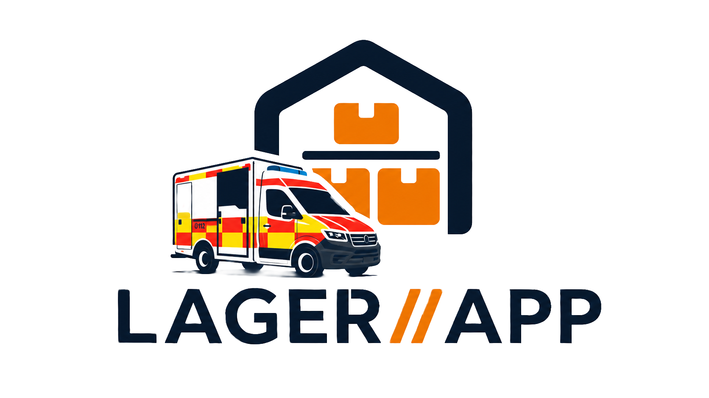

# LAGER//APP

Digitale Lagerverwaltung für die DRK Rettungswache Malmsheim. Progressive Web App (PWA) auf Basis von Firebase Firestore – ohne Framework, reines HTML/CSS/JavaScript.



---

## Features

### Für alle (kein Login nötig)
- **Lagersuche** – Artikel nach Name, Alias oder Lagerplatznummer (LP) suchen
- **Bereichs-Übersicht** – alle Lagerbereiche (Schränke, Regale) auf einen Blick
- **Kamera-Scan** – Barcode oder LP-Etikett scannen, Lagerort wird direkt angezeigt
- **Dunkel/Hell-Modus** – systemweites Theme, persistent via `localStorage`

### Für Mitarbeiter (Name + PIN)
- **Mitarbeiter-Hub** – persönliche Startseite nach PIN-Login
- **Lagerbestellung / Lagercheck** – Bestandskontrolle durchführen, Nachbestellungen markieren
- **StockSwipe** – Tinder-ähnliches Swipe-UI für schnelle Bestandserfassung (OK / Nicht OK)
- **Charge-Scanner** (`scanner.html`) – GS1-DataMatrix und HIBC-Barcodes per Kamera oder Bluetooth-Scanner einlesen; LOT-Nummer und Verfallsdatum je Artikel speichern

### Für Wachenleiter (Firebase-Login)
- **Wachenleiter-Portal** – Übersicht offener Bestellungen und Lagerchecks
- **Verfallmonitor** – alle Chargen mit abgelaufenem oder bald ablaufendem Datum im Überblick

### Für Admins (Firebase-Login, Rolle `admin`)
- **Admin-Panel** mit Sidebar-Navigation:
  - **Dashboard** – KPIs (Artikelanzahl, Bereiche, Bestellungen, Artikel ohne Foto)
  - **Artikelverwaltung** – CRUD für alle Lagerartikel inkl. Min/Max-Mengen, Aliases, Hinweise
  - **Bereiche** – Lagerorte anlegen und sortieren
  - **Fotos & Bilder** – Produkt- und Lagerortsfotos via Cloudinary hochladen
  - **StockSwipe-Fotos** – separate Kartenfotos für StockSwipe verwalten
  - **Account-Verwaltung** – Wachenleiter- und Admin-Accounts anlegen (Firebase REST API)
  - **PIN ändern** – Mitarbeiter-PIN für den Lagercheck
  - **Backup & Import** – Datenbank als JSON exportieren/importieren, Bilder als ZIP

---

## Authentifizierung

Das System kennt drei Zugriffsebenen:

| Ebene | Methode | Zugang zu |
|---|---|---|
| Gast | keiner | Lagersuche, Bereichsübersicht |
| Mitarbeiter | Name + 4-stelliger PIN | Hub, Lagercheck, StockSwipe, Charge-Scanner |
| Wachenleiter / Admin | E-Mail + Passwort (Firebase Auth) | Portal, Admin-Panel, Verfallmonitor |

Der Mitarbeiter-PIN wird in Firestore unter `config/app.pin` gespeichert und gilt für alle. Rollen für Firebase-Nutzer (`wachenleiter` / `admin`) werden in der Collection `users` hinterlegt.

---

## Tech-Stack

| Bereich | Technologie |
|---|---|
| Frontend | Vanilla HTML, CSS, JavaScript (kein Framework) |
| Datenbank | Firebase Firestore v10 |
| Auth | Firebase Authentication |
| Bilderspeicher | Cloudinary (unsigned upload) |
| Barcode-Scan | ZXing `@zxing/library@0.19.1` |
| PWA | Web App Manifest + Service Worker (`sw.js`) |
| Fonts | Geist, IBM Plex Mono (Google Fonts) |
| Hosting | statisch, z. B. Firebase Hosting |

---

## Firestore-Datenstruktur

```
bereiche/          Lagerbereiche (Schränke, Regale)
  {id}
    name:          string
    reihenfolge:   number
    sub?:          string

artikel/           Lagerartikel
  {id}
    name:          string
    lp:            string        // Lagerplatznummer, z. B. "S.2.1.3"
    location:      string        // Standort-Code
    bereich:       string        // Referenz auf bereiche/{id}
    min:           number
    minEinheit:    string
    max:           number
    maxEinheit:    string
    aliases:       string[]
    hinweis?:      string
    gtin?:         string
    gtins?:        string[]
    fotoUrl?:      string        // Cloudinary-URL Produktfoto
    lagerFotoUrl?: string        // Cloudinary-URL Lagerortsreferenz
    ssFotoUrl?:    string        // Cloudinary-URL StockSwipe-Karte
    chargen?:      Array<{
      lot:         string
      verfall:     string        // ISO-Datum YYYY-MM-DD
      gtin?:       string
      erfasst:     string        // ISO-Timestamp
    }>

bestellungen/      Lagerchecks / Bestellungen
  {id}
    mitarbeiter:   string
    datum:         Timestamp
    nachbestellungen: Array<...>

users/             Firebase-Nutzerprofile
  {uid}
    name:          string
    email:         string
    role:          "wachenleiter" | "admin"
    createdAt:     string

config/
  app
    pin:           string        // 4-stelliger Mitarbeiter-PIN
```

---

## Projektstruktur

```
lagerapp_alpha-main/
├── index.html              Startseite – Lagersuche & Bereichsübersicht
├── manifest.json           PWA-Manifest
├── sw.js                   Service Worker
├── serve.py                Lokaler Dev-Server (Python)
├── mockup.html             Design-Mockup / Playground
├── css/
│   ├── main.css            Design-System (Tokens, Komponenten)
│   └── index.css           Seiten-spezifische Styles (Legacy)
├── js/
│   ├── firebase-config.js  Firebase-Projektkonfiguration
│   ├── pwa.js              Service-Worker-Registrierung
│   └── theme.js            Theme-Toggle-Hilfsfunktionen
├── pages/
│   ├── login.html          Login (PIN & Firebase)
│   ├── mitarbeiter.html    Mitarbeiter-Hub
│   ├── check.html          Lagercheck / Bestellung
│   ├── stockswipe.html     StockSwipe-Bestandserfassung
│   ├── scanner.html        Charge-Scanner (GS1/HIBC)
│   ├── verfallmonitor.html Verfallsübersicht
│   ├── portal.html         Wachenleiter-Portal
│   └── admin.html          Admin-Panel
└── icons/                  PWA-Icons (192 & 512 px, hell & dunkel)
```

---

## Lokale Entwicklung

Python-Skript zum Starten eines einfachen HTTP-Servers:

```bash
python serve.py
```

Danach unter `http://localhost:8000` erreichbar. Firebase-Credentials sind bereits in `js/firebase-config.js` eingetragen.

---

## Barcode-Formate (Charge-Scanner)

Der Scanner unterstützt:

- **GS1-DataMatrix / GS1-128** – mit und ohne Klammer-Notation
  - AI `01` → GTIN-14
  - AI `10` → LOT / Chargennummer
  - AI `17` → Verfallsdatum (YYMMDD)
- **HIBC** – Sekundärsegment mit `/$$/` – Monat/Jahr + LOT
- **EAN-13**, **Code 128**, **QR Code** – für Artikelsuche per LP

Bluetooth-Scanner werden als HID-Tastatur unterstützt (Keydown-Listener mit 150 ms Puffer).

---

## Farbschema & Design

Die App verwendet ein eigenes Design-System in `css/main.css` mit CSS-Custom-Properties:

- **Brand-Orange** `#F26B2E` – Akzentfarbe, CTAs
- **Dark Theme** Standard (`data-theme="dark"`)
- **Light Theme** umschaltbar, gespeichert in `localStorage`
- Glassmorphismus-Navbar mit `backdrop-filter: blur`
- Responsive: Mobile-First, Desktop-Breakpoints bei 768 px und 1024 px

---

## Bekannte Einschränkungen (Alpha)

- Kein Offline-Support für Schreiboperationen (Firestore-Persistence nur lesend aktiv)
- Benutzerverwaltung läuft über die Firebase REST API direkt im Browser (API-Key im Quellcode)
- Der Mitarbeiter-PIN gilt global (kein Pro-User-PIN)
- Bildupload nur über Cloudinary (kein Firebase Storage)
